<h1 align="center">🚀 Product Management System for Energy Drinks 🥤</h1>

Empowering the energy drink industry with a modern, data-driven, and customer-focused platform.

---

## 📌 Overview

The **Product Management System** is a dynamic software solution crafted to revolutionize the energy drink industry by streamlining the entire product lifecycle. From product development to personalized customer experiences, it brings innovation, efficiency, and smart decision-making — all in one place.

✨ Designed for:
- Energy drink manufacturers
- Product teams
- Admins and end-customers  
- Businesses seeking scalable digital transformation

---

## 🎯 Objectives

- ✅ Develop a **user-centric platform** for energy drink brands
- ✅ Streamline communication and collaboration between teams
- ✅ Enable **data-driven decision making** using customer feedback
- ✅ Provide a **secure admin panel** to control all functionalities
- ✅ Deliver **personalized recommendations** and experiences to users

---

## 🧠 System Breakdown

### 🔎 Existing System — Challenges
- ❌ Lack of customer-centric strategy
- ❌ Poor team collaboration
- ❌ Limited use of analytics
- ❌ No admin-level control or data security

### 💡 Proposed System — Solutions
- ✅ Customer preference assessment & feedback loops
- ✅ Secure **user data management**
- ✅ Powerful **admin dashboard** with role-based access
- ✅ Full-stack web implementation with encryption and control

---

## 🧩 Project Modules

### 👑 Admin Panel
- 🔐 **Admin Login** (Authentication & RBAC)
- 💸 **Manage Rates** (View & Update Prices)
- 🛍️ **Add / Edit / Remove Products**

### 🛒 Customer Panel
- 🔍 **Product Selection & Cart**
- 🙋‍♂️ **User Registration & Profile**
- 💳 **Checkout Flow** (Shipping, Payment & Order Summary)

---
## Pictures
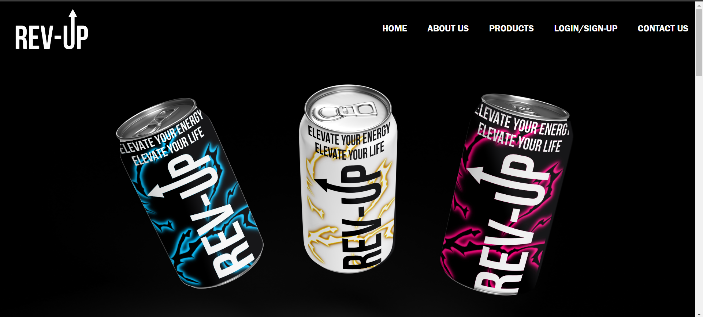
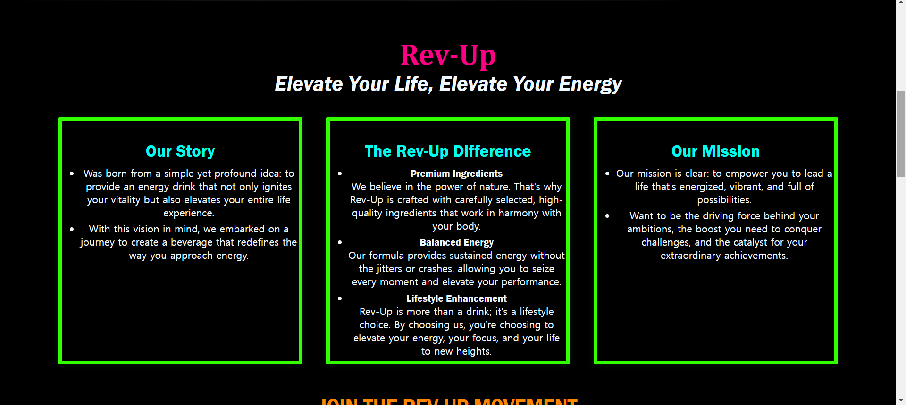
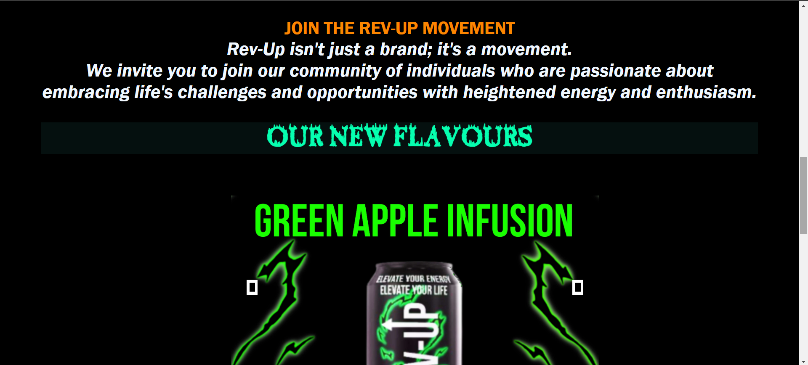
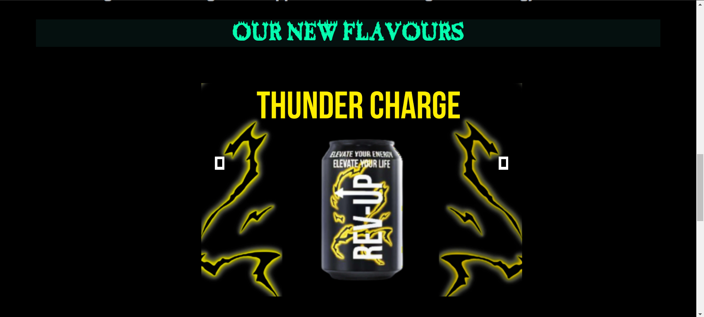
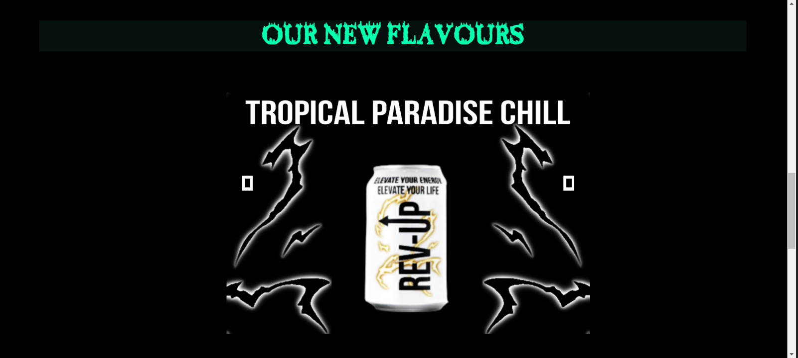
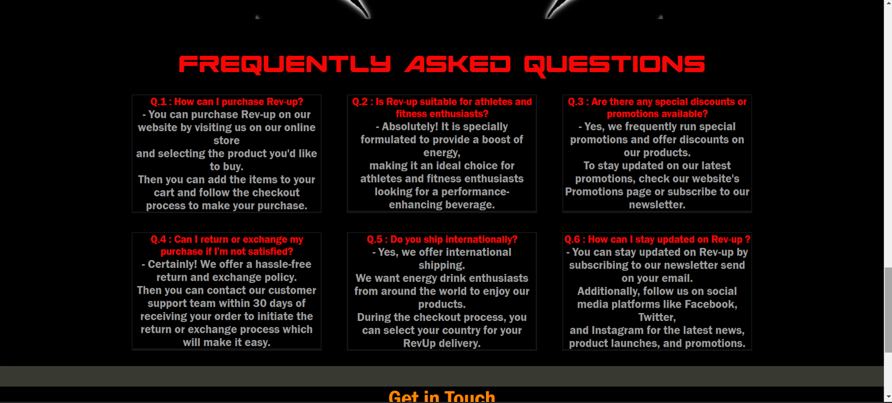
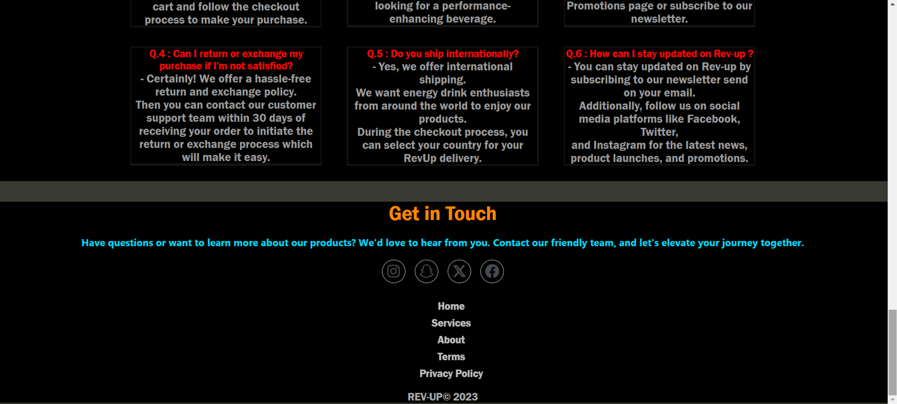
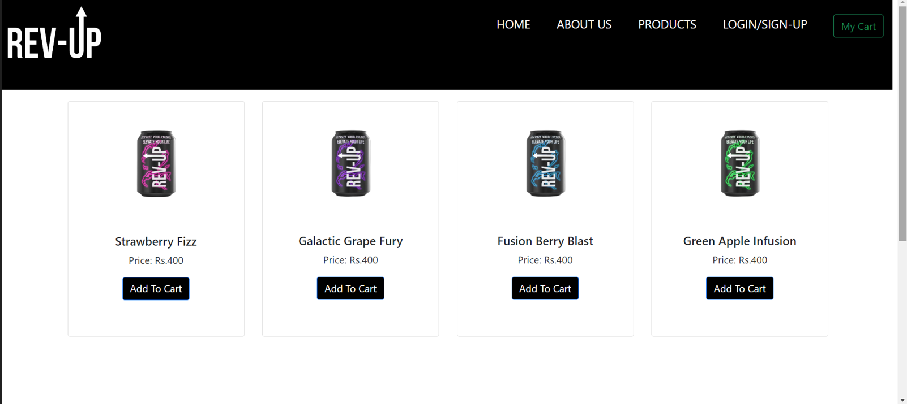
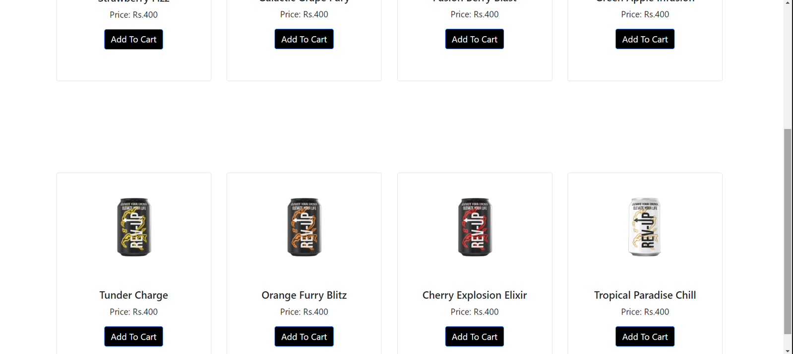
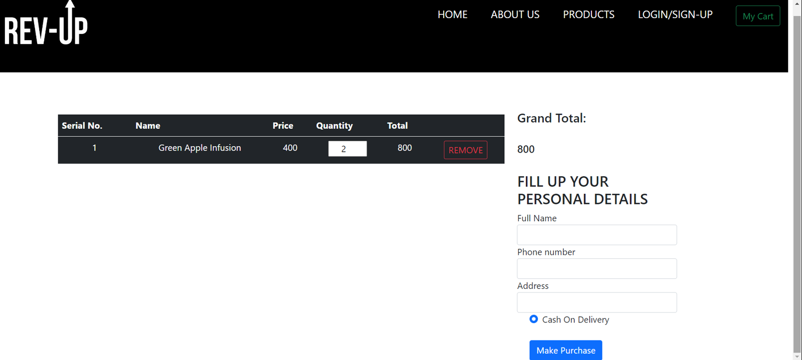
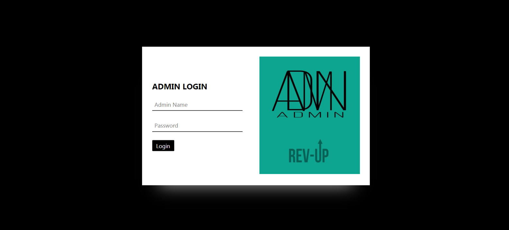

## 💻 Tech Stack

| Type               | Tools / Technologies            |
|--------------------|----------------------------------|
| 💻 Frontend        | HTML, CSS, JavaScript            |
| ⚙️ Backend         | PHP                              |
| 🗄️ Database        | MySQL                            |
| 🌐 Browser         | Chrome                           |
| 🛠️ Server          | XAMPP                            |
| 💽 OS              | Microsoft Windows 11             |
| 🔧 Processor       | Intel Core i5 (1.60–2.11 GHz)     |
| 🧠 RAM             | 8 GB                             |

---

## 📚 References

1. [ResearchGate](https://www.researchgate.net)  
2. [SlideShare](https://www.slideshare.net/apevp)  
3. [PHP Gurukul](https://phpgurukul.com)  
4. [IRJET](https://www.irjet.net)  

---

## 🏁 Developed By

**Akanksha Job** 

---

> 🌟 *"Crafted with purpose, powered by feedback, and inspired by innovation."*